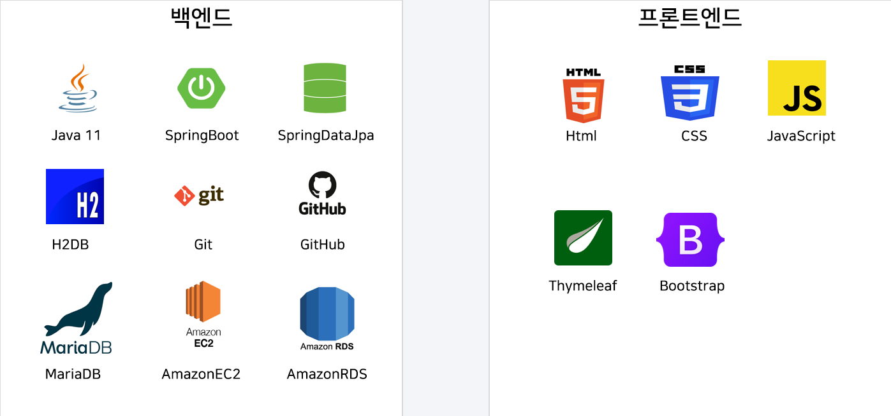

<h1>🏢 경성호텔</h1>

[경성호텔 바로가기🔗](http://3.36.206.91/)

  

<h2> 🧭 서비스 소개 </h2>

경성 호텔은 호텔 알바를 했던 경험을 통해 우리가 직접 

가상의 호텔 홈페이지를 제작하면 어떨까? 라는 

아이디어에서 시작된 반응형 호텔 홈페이지입니다.

[상세보기 링크 🔗](https://1drv.ms/p/s!AuJ-4-uBRTtH-1rbjX2L1J7xtOIh?e=5KWamQ)

  

<h2> ‍🤝 팀원 </h2>

|                        [박대준](https://github.com/pt807)                      |                        [김병훈](https://github.com/hunbk)                        |
|:-----------------------------------------------------------------------------:|:-----------------------------------------------------------------------------:|
|  |  |
|                                    백엔드/프론트                                    |                                    백엔드/프론트                                    |

  

<h2> 📚 기술스택 </h2>

  
